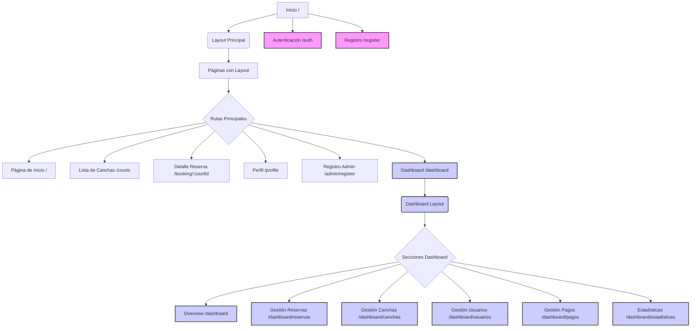

# Plan de Estructura del Dashboard

Este documento describe la estructura propuesta para el dashboard de administración del sistema de reserva de canchas.

## Secciones Principales

El dashboard se dividirá en las siguientes secciones principales, accesibles a través de la navegación:

1.  **Panel Principal (Overview):**
    *   Resumen visual de la actividad reciente.
    *   Estadísticas clave (reservas hoy/semana, canchas disponibles, ingresos estimados).
    *   Próximas reservas.

2.  **Gestión de Reservas:**
    *   Lista completa de reservas con filtros y búsqueda.
    *   Detalle de reserva (usuario, cancha, fecha, hora, estado, pago).
    *   Funcionalidad para crear, editar y cancelar reservas manualmente.
    *   Vista de calendario de ocupación.

3.  **Gestión de Canchas:**
    *   Lista de canchas existentes.
    *   Formulario para agregar nueva cancha.
    *   Funcionalidad para editar y eliminar canchas.
    *   Configuración de detalles de la cancha (nombre, tipo, ubicación, características, precio, horarios disponibles).

4.  **Gestión de Usuarios:**
    *   Lista de usuarios registrados.
    *   Detalle de usuario (información de contacto, historial de reservas).
    *   Funcionalidad para editar y eliminar usuarios.
    *   Gestión de roles (administrador/cliente).

5.  **Gestión de Pagos:**
    *   Lista de transacciones de pago.
    *   Detalle de transacción (reserva asociada, monto, método, estado).
    *   Filtros por estado, fecha, usuario.

6.  **Estadísticas e Informes:**
    *   Visualizaciones gráficas (uso de canchas por hora/día, ingresos por período, usuarios activos).
    *   Informes descargables.

## Estructura Técnica (Frontend)

En el frontend (React), esto se traducirá en:

*   Una ruta principal `/dashboard`.
*   Sub-rutas anidadas para cada sección (ej. `/dashboard/reservas`, `/dashboard/canchas`).
*   Un componente de Layout específico para el dashboard (`DashboardLayout`), que incluirá una barra lateral de navegación y el área de contenido principal.
*   Componentes de página/vista para cada sección (ej. `DashboardOverviewPage`, `ReservasGestionPage`, `CanchasGestionPage`, etc.).
*   Componentes más pequeños y reutilizables dentro de cada sección (tablas, formularios, gráficos).

## Diagrama de Rutas Propuesto

Por favor, revisa este plan y házmelo saber si estás de acuerdo o si te gustaría hacer algún ajuste antes de comenzar con la implementación.
